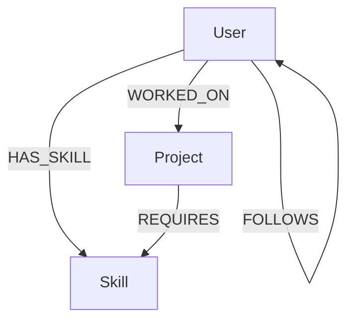
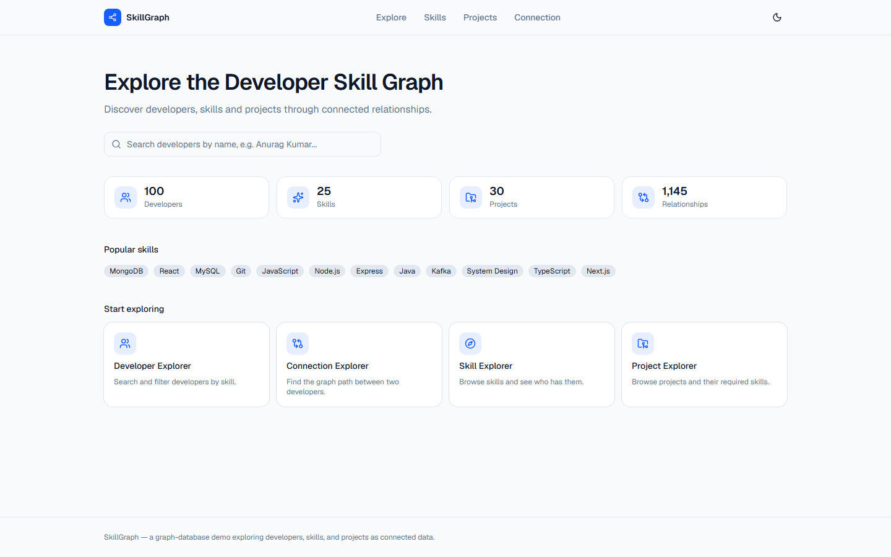
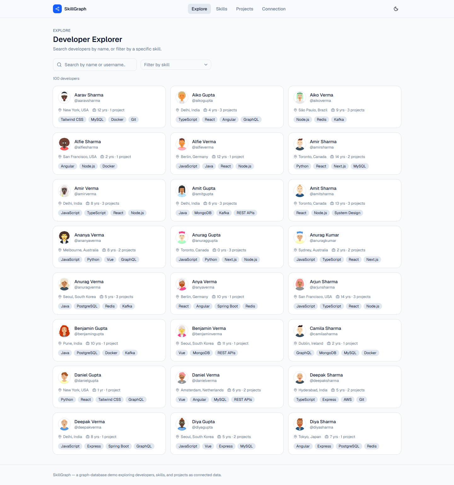
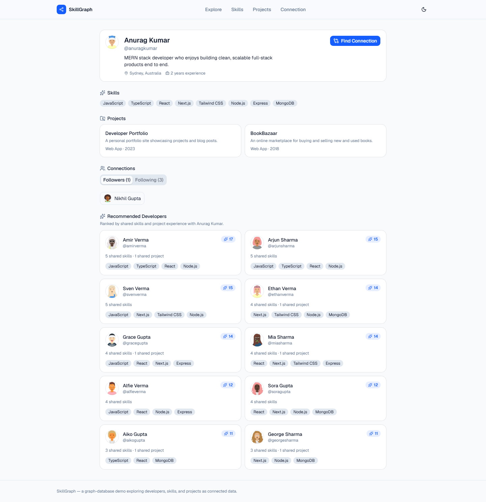
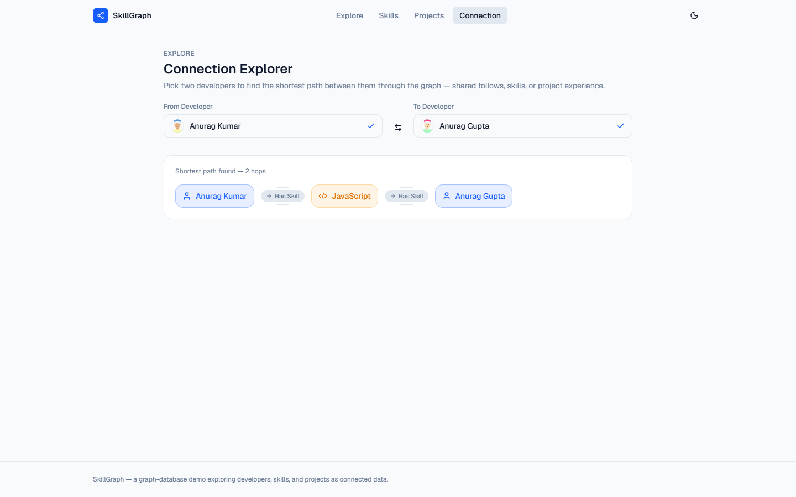
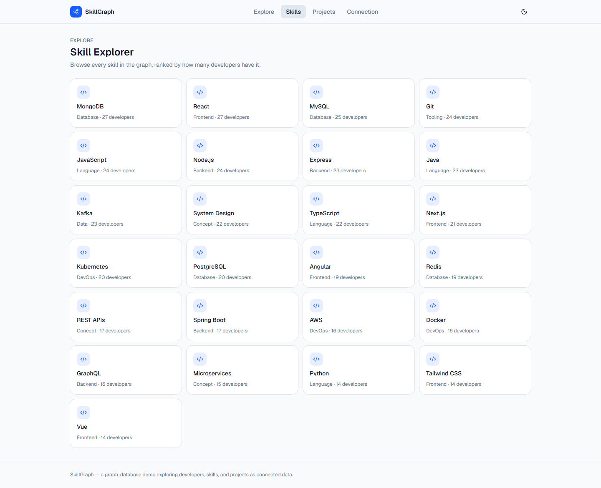

# SkillGraph — Backend

Express + TypeScript + official `neo4j-driver` API for **SkillGraph**, a small graph
database demo that explores developers, skills, and projects as connected data,
backed by [CognoDB Cloud](https://console.cognodb.com).

**Frontend repo:** https://github.com/keshri29/wexa-ai-CognoDB-Assignment-2-Application
**Live demo:** https://wexa-ai-cogno-db-assignment-2-appli-ruddy.vercel.app/ (backend API: https://skillgraph-api-0bry.onrender.com)

---

## Project Overview

SkillGraph models a developer network in CognoDB Cloud (a Neo4j-protocol graph
database, queried here with the official `neo4j-driver`). Developers, their skills,
and the projects they've built are all first-class nodes connected by typed
relationships. The API backing the app supports:

- Searching/browsing developers, including filtering by a specific skill.
- Full developer profiles: skills, projects, and follow connections.
- **Recommended collaborators** — developers ranked by shared skills and shared
  project experience.
- The **shortest connection path** between any two developers, even when they've
  never directly interacted — the path can hop through shared skills or projects.
- Skill and project exploration, including how skills/projects relate to each other.
- Live graph statistics (developers, skills, projects, relationships), computed
  directly from the database — never hardcoded.

---

## Why a Graph Database?

SkillGraph's core interactions — "find developers like this one," "how are these two
people connected," "what else pairs with this skill" — are all fundamentally about
**traversing relationships**, not filtering rows. That's the specific reason a graph
database is the right fit here, not a general performance claim:

- **Relationships are first-class data.** `HAS_SKILL`, `WORKED_ON`, `REQUIRES`, and
  `FOLLOWS` are stored as their own typed entities with O(1) traversal cost from either
  endpoint. In a relational schema the same model needs three join tables
  (`user_skills`, `user_projects`, `project_skills`) plus a self-referencing
  `follows` table, and every "who's connected to whom" question becomes a multi-table
  `JOIN`.

- **Multi-hop traversal stays cheap as hops increase.** The recommendation query walks
  `User → Skill → User` in one pattern match. The related-skills query walks
  `Skill → Project → Skill`. Neither degrades as the graph grows, because each hop
  follows a relationship pointer directly to its connected node — there's no join
  index to rebuild or query planner to guess correctly. The equivalent relational
  query is a self-join across three tables, and a fourth hop means a fourth join.

- **Shortest-path search is a primitive, not a recursive CTE.** The path-finding
  query's `shortestPath()` (see below) finds the shortest chain between two developers
  across *any* relationship type in one call. In SQL this requires a recursive common
  table expression that re-scans join tables at every depth level — workable at small
  depth, painful and slow past 3-4 hops.

- **Recommendation scoring reads naturally as a graph pattern.** "Developers who share
  a skill with me, weighted by how many skills and shared projects we have in common"
  is one Cypher pattern with a `count()` aggregation. The relational equivalent is a
  self-join on the skills junction table, grouped and scored — correct, but the
  relationships driving the logic are implicit in join conditions instead of explicit
  in the schema.

- **The schema mirrors the mental model.** A developer, a skill, and a project *are*
  connected things — modeling them as nodes and relationships means the database
  schema is a direct translation of "how developers actually relate," not a
  normalization exercise that then has to be joined back together for every query.

None of this means graph databases are faster in general — for pure aggregate
reporting over flat data, a relational or columnar store often wins. The reason
SkillGraph uses one is that its actual feature set (path-finding, multi-hop
recommendations, "related X via shared Y") is exactly the class of problem graph
traversal is built for.

---

## Data Model



### Nodes

| Node | Properties |
|------|------------|
| `User` | `id`, `name`, `username`, `avatar`, `bio`, `location`, `experience` |
| `Skill` | `id`, `name`, `category` |
| `Project` | `id`, `name`, `description`, `category`, `year` |

### Relationships

| Relationship | Meaning |
|---|---|
| `(User)-[:HAS_SKILL]->(Skill)` | This developer has this skill. |
| `(User)-[:WORKED_ON]->(Project)` | This developer worked on this project. |
| `(Project)-[:REQUIRES]->(Skill)` | This project requires this skill. |
| `(User)-[:FOLLOWS]->(User)` | This developer follows another developer. |

Uniqueness constraints are created on `User.id`, `Skill.id`, and `Project.id` in
`scripts/seed.ts`.

---

## Query Documentation

All queries live in `src/queries/*.ts` as parameterized Cypher strings — never
string-concatenated — and are executed by the matching `src/repositories/*.ts` file,
which also maps raw Neo4j records into typed domain objects.

### 1. Search by skill

**File:** `queries/userQueries.ts` → `SEARCH_USERS`
**What it does:** Finds developers, optionally filtered by an exact skill name
(case-insensitive) and/or a name/username substring, with pagination.
**Why graph traversal helps:** `(u:User)-[:HAS_SKILL]->(s:Skill)` is a direct pointer
hop — no join table to scan.
**Params:** `{ skill: string | null, search: string | null, skip: number, limit: number }`

### 2. User profile traversal

**File:** `queries/userQueries.ts` → `GET_USER_PROFILE`
**What it does:** In one round trip, gathers a developer's skills, projects, followers,
and who they follow.
**Why graph traversal helps:** Four different relationship types are gathered from the
same anchor node without four separate queries or a wide multi-table join.
**Params:** `{ id: string }`

### 3. Multi-hop path (shortest path)

**File:** `queries/graphQueries.ts` → `FIND_SHORTEST_PATH`

```cypher
MATCH (a:User {id: $from}), (b:User {id: $to})
MATCH path = shortestPath((a)-[*..8]-(b))
RETURN path
```

**What it does:** Finds the shortest chain of relationships between two developers,
in **either direction** and across **any relationship type** — the path might read
`User -[:FOLLOWS]-> User`, or it might read
`User -[:HAS_SKILL]-> Skill <-[:HAS_SKILL]- User`, or something longer through a
shared project. The `-[*..8]-` variable-length pattern caps the search at 8 hops so it
stays bounded on a graph this size.
**Why graph traversal helps:** `shortestPath()` is a database primitive here — the
equivalent in SQL is a recursive CTE that re-joins the relationship tables at every
depth, which gets expensive fast as hop count grows.
**Params:** `{ from: string, to: string }`

### 4. Recommendations

**File:** `queries/userQueries.ts` → `GET_RECOMMENDATIONS`

```cypher
MATCH (u:User {id: $userId})-[:HAS_SKILL]->(s:Skill)<-[:HAS_SKILL]-(candidate:User)
WHERE candidate.id <> $userId
WITH u, candidate, collect(DISTINCT s) AS matchedSkills
WITH u, candidate, matchedSkills, size(matchedSkills) AS sharedSkills
OPTIONAL MATCH (u)-[:WORKED_ON]->(p:Project)<-[:WORKED_ON]-(candidate)
WITH candidate, matchedSkills, sharedSkills, count(DISTINCT p) AS sharedProjects
RETURN candidate, matchedSkills, sharedSkills, sharedProjects,
       (sharedSkills * 3 + sharedProjects * 2) AS score
ORDER BY score DESC, candidate.name ASC
LIMIT $limit
```

**What it does:** Starting from a developer's skills, finds every other developer who
shares at least one, counts the overlap, adds bonus weight for shared project
experience, and ranks by a combined score (skills weighted higher than projects, since
a shared skill is a stronger collaboration signal than having independently worked on
similarly-named projects).
**Why graph traversal helps:** The whole scoring logic is one pattern match plus an
aggregation — no precomputed similarity table required.
**Params:** `{ userId: string, limit: number }`

### 5. Related skills

**File:** `queries/skillQueries.ts` → `GET_RELATED_SKILLS`

```cypher
MATCH (s:Skill {id: $id})<-[:REQUIRES]-(p:Project)-[:REQUIRES]->(related:Skill)
WHERE related.id <> $id
WITH related, count(DISTINCT p) AS sharedProjects
RETURN related, sharedProjects
ORDER BY sharedProjects DESC, related.name ASC
LIMIT $limit
```

**What it does:** Hops `Skill -> Project -> Skill` — any skill that shows up on a
project alongside this one counts as "related," ranked by how many projects they share.
**Why graph traversal helps:** This is a textbook 2-hop traversal; the relational
version needs a self-join on the project-skills junction table.
**Params:** `{ id: string, limit: number }`

### 6. Project relationships

**File:** `queries/projectQueries.ts` → `GET_PROJECT_DETAIL`
**What it does:** Returns a project's developers, required skills, and related
projects (found the same way as related skills, but walking
`Project -> Skill -> Project`).
**Why graph traversal helps:** Three different relationship shapes (incoming
`WORKED_ON`, outgoing `REQUIRES`, and a 2-hop `REQUIRES` chain) are resolved from one
anchor node in a single query.
**Params:** `{ id: string }`

---

## API Reference

| Method | Route | Description |
|---|---|---|
| GET | `/api/health` | Database connectivity check |
| GET | `/api/users` | List/search developers (`?skill=`, `?search=`, `?page=`, `?limit=`) |
| GET | `/api/users/:id` | Full developer profile |
| GET | `/api/users/:id/recommendations` | Recommended collaborators |
| GET | `/api/skills` | List all skills |
| GET | `/api/skills/:id` | Skill detail (developers, projects, related skills) |
| GET | `/api/skills/:id/related` | Related skills only |
| GET | `/api/projects` | List all projects |
| GET | `/api/projects/:id` | Project detail |
| GET | `/api/graph/path?from=&to=` | Shortest path between two developers |
| GET | `/api/graph/stats` | Live graph-wide counts |

---

## Project Structure

```text
.
├── src/
│   ├── config/database.ts       # driver singleton, session helper, health check
│   ├── queries/                 # raw parameterized Cypher, one file per domain
│   ├── repositories/            # runs queries, maps records -> domain types
│   ├── services/                # business logic, validation, 404s
│   ├── controllers/             # HTTP layer, request/response only
│   ├── routes/
│   ├── middleware/               # asyncHandler, error handler
│   └── types/
├── scripts/seed.ts               # idempotent demo data seeding
└── tests/                        # health, users, path endpoint tests
```

---

## Local Setup

### 1. Clone and install

```bash
git clone https://github.com/keshri29/wexa-ai-CognoDB-Assignment-2-Application-be.git
cd wexa-ai-CognoDB-Assignment-2-Application-be
npm install
```

### 2. Create a CognoDB Cloud instance

1. Sign up at [console.cognodb.com/signup](https://console.cognodb.com/signup) — the
   free tier requires no credit card.
2. From the console, create a free (`c0`) instance and pick a region. It provisions
   in under a minute; each workspace gets one free instance.
3. Save your connection details immediately: a URI of the form
   `bolt+s://<instance-id>.databases.cognodb.cloud` and a **generated password for the
   user `cognodb`**. The password is shown exactly once — copy it before leaving the
   page.
4. That's it — this backend connects with the official `neo4j-driver` and speaks
   openCypher over Bolt, so no other setup is needed.

### 3. Configure environment variables

```bash
cp .env.example .env
# edit .env with your COGNODB_URI / COGNODB_USERNAME / COGNODB_PASSWORD
```

### 4. Seed the database

```bash
npm run seed
```

This creates uniqueness constraints, clears any previously seeded demo data, and
inserts ~100 developers, 25 skills, 30 projects, and 300+ relationships. Safe to
re-run any time.

### 5. Run

```bash
npm run dev      # http://localhost:5000
```

Pair it with the [frontend repo](https://github.com/keshri29/wexa-ai-CognoDB-Assignment-2-Application) pointed at this URL via `NEXT_PUBLIC_API_URL`.

### 6. Run tests

```bash
npm test
```

---

## Deployment

A `render.yaml` blueprint is included for [Render](https://render.com):

1. Create a new Blueprint in Render pointed at this repository.
2. Set `COGNODB_URI`, `COGNODB_USERNAME`, `COGNODB_PASSWORD`, and `CORS_ORIGIN`
   (your deployed frontend URL) as environment variables in the Render dashboard —
   these are marked `sync: false` in the blueprint so they're never committed.
3. Render runs `npm install && npm run build` then `npm start`.

Railway or Fly.io work the same way — set the same four environment variables and
point the start command at `npm start` (after `npm run build`).

**Never commit `.env`.** Only `NEXT_PUBLIC_API_URL` is safe to expose to the frontend —
database credentials never leave this backend.

---

## Screenshots

Captured against a live CognoDB Cloud instance seeded with the real dataset (100
developers, 25 skills, 30 projects), via the [frontend app](https://github.com/keshri29/wexa-ai-CognoDB-Assignment-2-Application).

**Home**


**Developer Explorer**


**Developer Profile & Recommendations**


**Connection Explorer** — shortest path between two developers, hopping through a
shared skill.


**Skill Explorer**


---

## Testing

`tests/` covers the health endpoint, user search, user profile, recommendations, and
the path-finding endpoint, using Jest + Supertest with the service layer mocked so
they run without a live database connection:

```bash
npm test
```

---

## What This Project Deliberately Doesn't Have

No authentication, subscriptions, billing, admin panel, or team management — the goal
is to demonstrate graph modeling and traversal clearly, not to ship a SaaS product.
